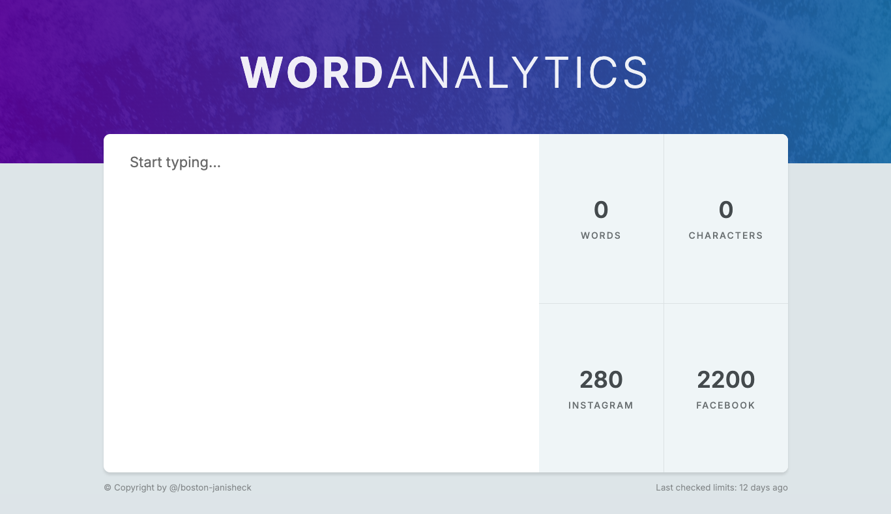
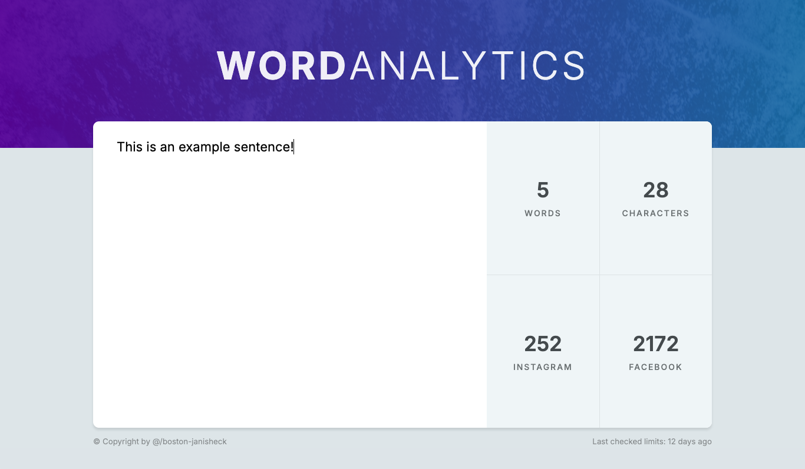
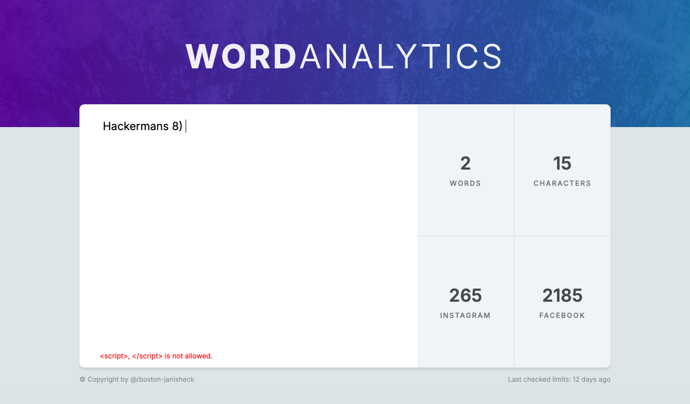

# Word Analytics

Word Analytics is a React application designed to analyze text input and provide real-time statistics. This project demonstrates the application of React concepts such as state management, component-based architecture, and text validation.

## Features

- **Text Validation:** Filters out not allowed text patterns such as ` is pasted in the textarea, displaying how the validation catches banned inputs and displays a warning at the bottom of the component._

## Learning Outcomes

This project facilitated learning in:

- Managing state efficiently through onChange event handling.
- Implementing real-time text input validation and manipulation.
- Developing modular, reusable components within a React application.
- Utilizing conditional rendering and dynamic class names based on component state.

This project was developed using the **Professional React & Next.js** tutorials on _bytegrad.com_.
